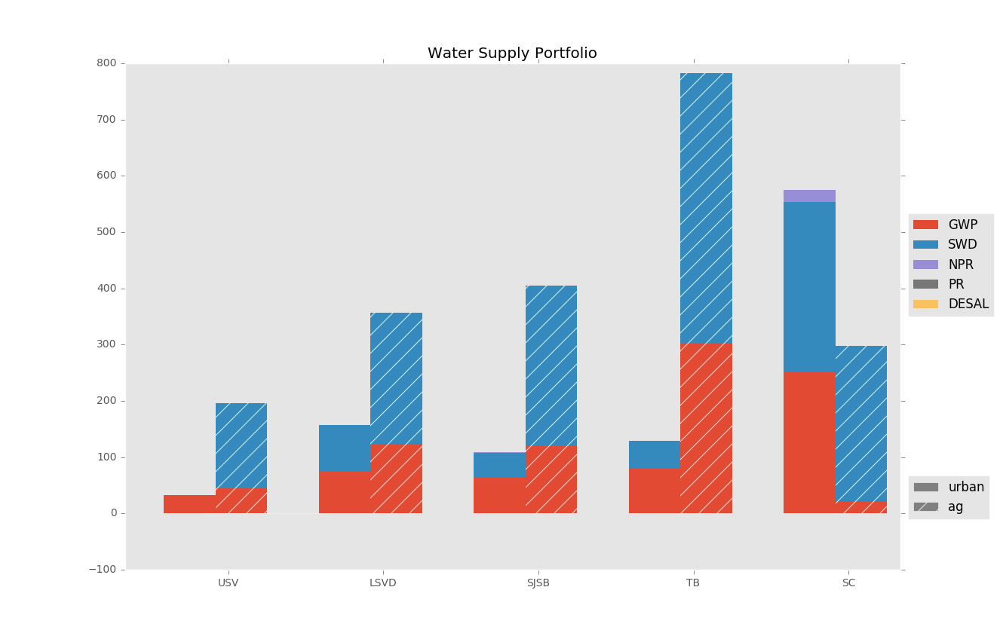

## Example Data Visualization: Supply Portfoilio

In general, plotting results is left to the user. A few useful plot types will be included in `calvin/plots.py`. One example is the supply portfolio stacked bar chart, which plots the sum of flows by each region, supply type, and urban/agricultural link type:

