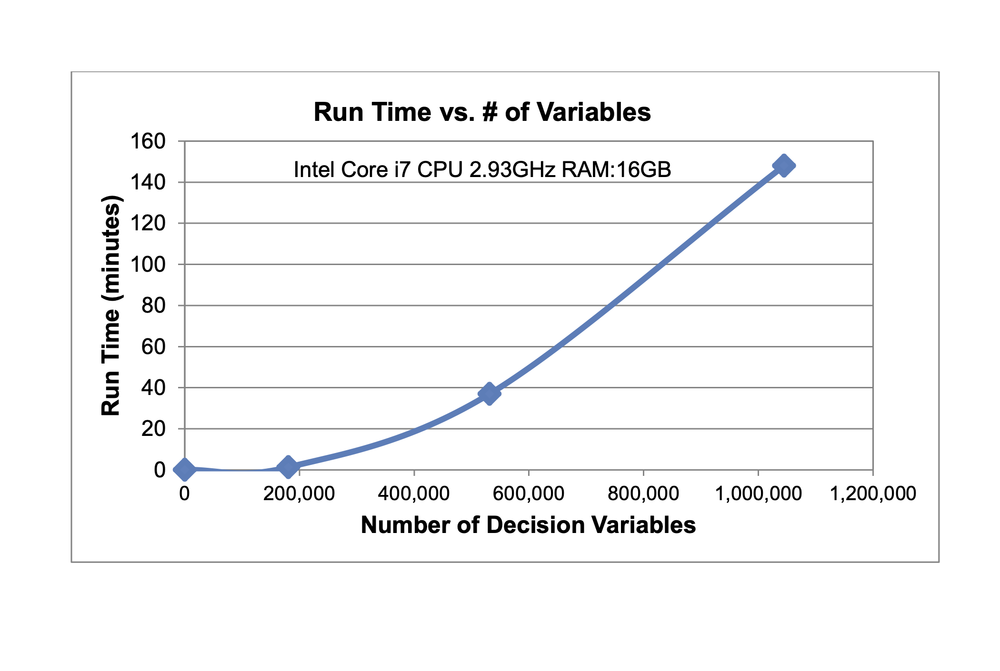
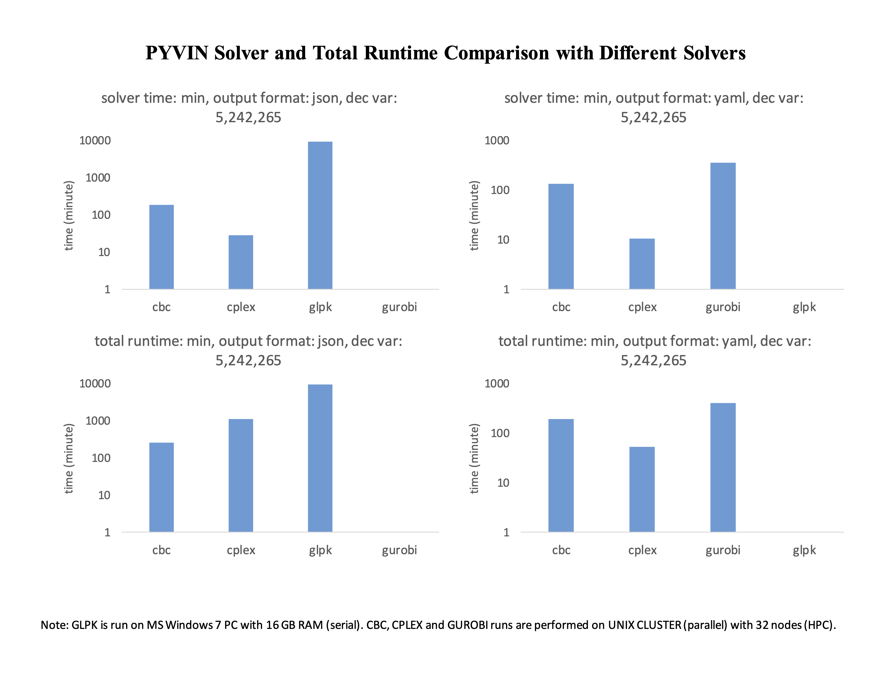

## Running in parallel

Several of the solvers available through Pyomo support shared-memory parallelization. (Importantly GLPK is one exception that does not support parallelization). To take advantage of this, change the script above to include:
```python
calvin.solve_pyomo_model(solver='cplex', nproc=32, debug_mode=True)
# do the same again for the non-debug mode run
```

## HP Computing
Several job scripts are included to support running on a SLURM cluster such as [HPC1](http://ssg.cs.ucdavis.edu/services/research/hpc1-cluster) at UC Davis. These will need to be customized for each system. 


## Runtime Comparisons





